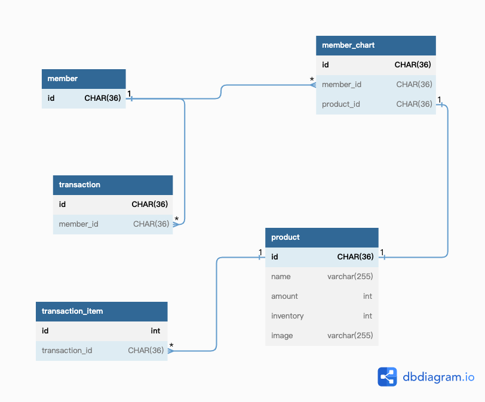

# 購物

## 資料關聯

[schema](../../../doc/db/DDL/ddl.sql)

[dbDiagram](https://dbdiagram.io/d/6332f1087b3d2034ffc9b338)

## API 介紹
    - POST /member/login
        - 服務器登入
        - in: service/internal/model/dto/session.MemberSessionCond
        - out: service/internal/model/dto/session.MemberToken
    - POST /member/logout
        - 登出
    - GET /mall/products
        - 取得商品目錄
        - in: service/internal/model/dto/product.GetProductListCond
        - out: service/internal/model/dto/ListResp.ListResp(prodcut.ProductResp)
    - GET /mall/product/info
        - 取得商品內容
        - in: service/internal/model/dto/product.GetProductCond
        - out: service/internal/model/dto/product.ProductResp
    - POST /mall/order
        - 購物
        - in: service/internal/model/dto/order.CreateOrderCond 
    - GET /mall/order
        - 取得商品內容
        - out: service/internal/model/dto/ListResp.ListResp(order.OrderResp)
    - GET /mall/member/chart 
        - 取得購物車
        - out: service/internal/model/dto/ListResp.ListResp(chart.MemberChart)
    - POST /mall/member/chart 
        - 取得商品內容
        - in: service/internal/model/dto/chart.MemberChartCreateCond
    - PUT /mall/member/chart 
        - 取得商品內容
        - in: service/internal/model/dto/chart.MemberChartUpdateCond
    - DELETE /mall/member/chart 
        - 刪除購物車商品
        - in: service/internal/model/dto/chart.MemberChartDelCond 
   
   
